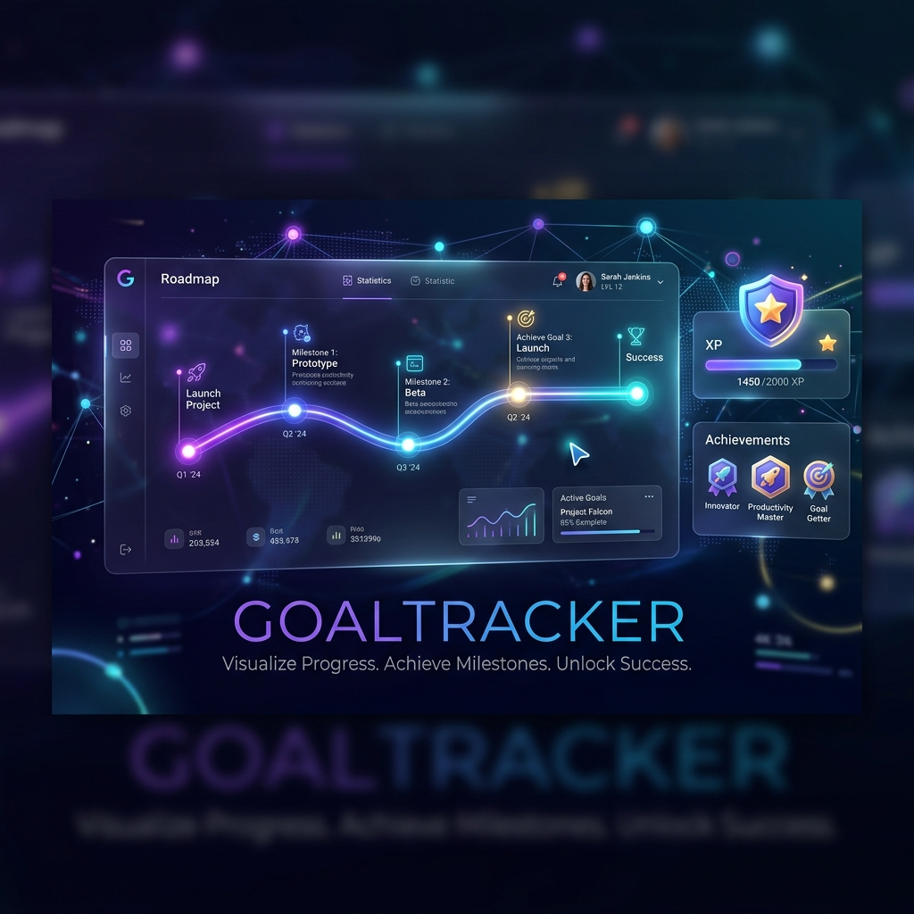

<div align="center">
  

  # 🚀 GoalTracker
  ### *The Ultimate AI-Powered Roadmap & Productivity Ecosystem*

  [](https://nextjs.org/)
  [](https://www.typescriptlang.org/)
  [](https://www.prisma.io/)
  [](https://tailwindcss.com/)
  [](https://deepmind.google/technologies/gemini/)

  ---

  **GoalTracker** is a premium, agency-grade productivity suite designed to bridge the gap between learning and execution. By leveraging **Gemini 2.0 Flash AI**, it generates personalized, milestone-driven roadmaps while gamifying your daily progress with XP, streaks, and achievements.

</div>

## 🌟 Premium Features

### 🤖 AI-Powered Intelligence
- **Instant Roadmap Generation**: Simply enter a goal (e.g., "Master Next.js"), and our Gemini-powered engine crafts a full path with milestones and granular tasks.
- **Smart Validation**: AI ensures your learning paths are logically structured and realistically achievable.

### 🎮 Gamified Productivity
- **XP & Leveling System**: Earn experience points for every task completed. Level up your profile and transition from a *Novice* to a *Level 99 Achiever*.
- **Daily Streaks**: Stay motivated with visual streak tracking. Maintain your flow and unlock the *Consistency King* title.
- **Achievements & Badges**: Unlock precision-engineered achievements:
  - **Early Bird**: For those who start before 8:00 AM.
  - **Productivity Ninja**: Complete 5+ tasks in a single day.
  - **Milestone Master**: Complete 10+ major milestones.
  - **Knowledge Seeker**: Fully complete your first roadmap.

### 📊 Professional Analytics
- **Visual Progress Tracking**: Beautiful charts powered by **Recharts** show your productivity velocity over time.
- **Productivity Scores**: Daily logs calculate a "Productivity Score" based on your performance.

### 📅 Advanced Organization
- **Visual Calendar**: A full-screen interactive calendar to manage your timeline effortlessly.
- **Interactive Roadmaps**: Drag-and-drop milestones, priority settings, and status management.
- **Pomodoro Focus**: Integrated timer for deep-work sessions (coming soon/integrated in planner).

---

## 🛠️ Tech Stack & Architecture

- **Frontend**: Next.js 16 (App Router), React 19, Framer Motion (Animations)
- **Styling**: Tailwind CSS (with custom "Curtain" theme toggle system)
- **Backend**: Next.js Server Actions, Prisma ORM
- **Database**: PostgreSQL (Scalable & Production-ready)
- **Authentication**: Clerk (Enterprise-grade security)
- **AI Engine**: Gemini 2.0 Flash via OpenRouter
- **State Management**: Zustand (Lightweight & Reactive)

---

## 📂 Project Structure

```text
src/
├── actions/            # Type-safe Server Actions for DB mutations
├── app/                # Next.js App Router (Protected & Public routes)
├── components/         # Atomic UI components & Feature-specific modules
├── features/           # Complex business logic components
├── hooks/              # Custom React hooks for global functionality
├── lib/                # Shared utilities, AI client, and Prisma setup
├── store/              # Zustand state orchestration
└── types/              # Centralized TypeScript definitions
```

---

## 🚀 Getting Started

### 1. Clone & Install
```bash
git clone https://github.com/your-username/goaltracker.git
cd goaltracker
npm install
```

### 2. Environment Setup
Create a `.env` file and populate:
```env
DATABASE_URL="your-postgresql-url"
OPENROUTER_API_KEY="your-api-key"

NEXT_PUBLIC_CLERK_PUBLISHABLE_KEY="pk_..."
CLERK_SECRET_KEY="sk_..."
```

### 3. Database Initialization
```bash
npx prisma generate
npx prisma db push
```

### 4. Launch Development
```bash
npm run dev
```

---

## 🎨 UI Aesthetics
- **Dark Mode First**: Optimized for long-night coding sessions.
- **Micro-animations**: Powered by Framer Motion for a "premium" feel.
- **Responsive Design**: Flawless experience across Mobile, Tablet, and Desktop.

---

## 📜 License
Licensed under the **MIT License**. Feel free to use this project for your own learning or as a template.

---

<div align="center">
  Built with ❤️ by the GoalTracker Team
</div>

